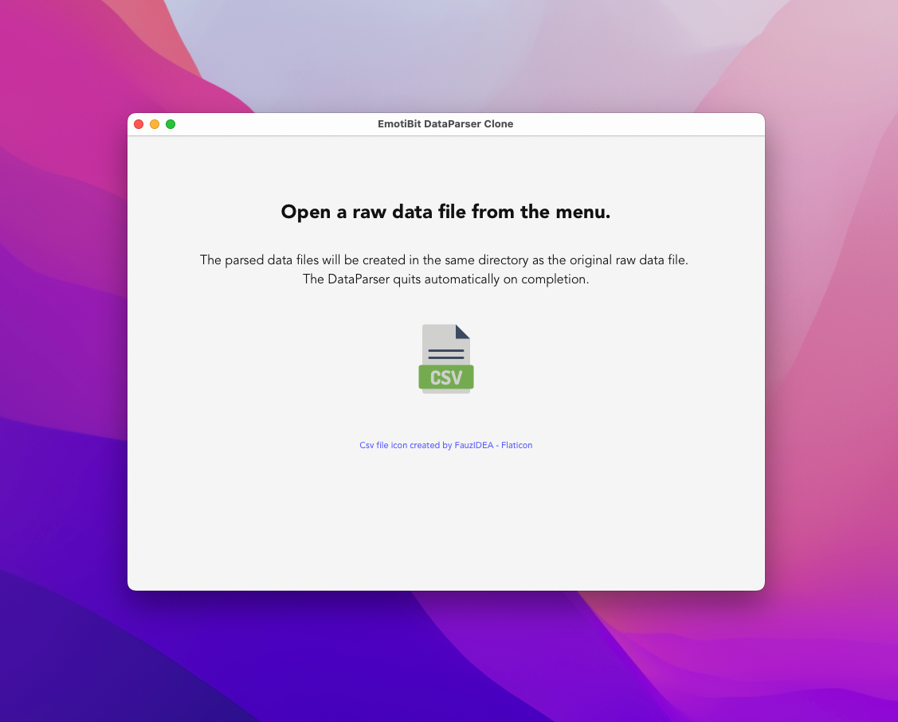

# EmotiBit DataParser Clone in Rust

A data parser app for processing [EmotiBit](https://www.emotibit.com) data

This app is powered by [emotibit-data crate](https://crates.io/crates/emotibit-data).

## Installation

Go to [the release page](https://github.com/lonesometraveler/emotibit-dataparser/releases) and download an installer for your platform. 

## Usage

Open the app. Choose a raw EmotiBit data file from the menu (shortcut: Cmd(or Ctrl) + O).

The parsed data will be created in the same directory as the original raw data file. The app automatically quits on completion.

If the app finds errors (malformed data, parse error, etc.), it writes them to a file. Find file_name_ERRORS.csv in the directory.